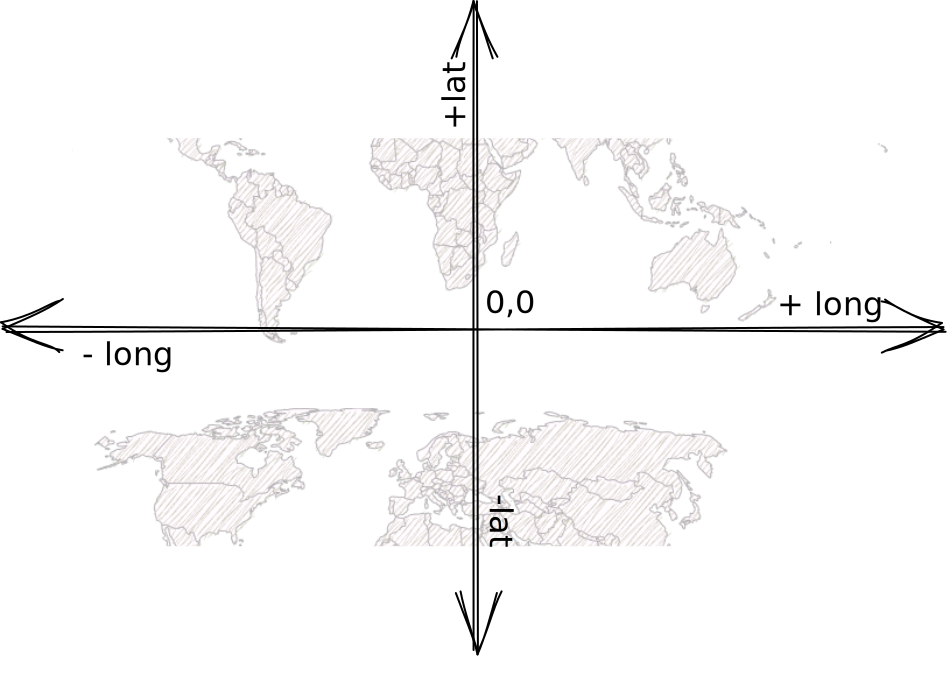

## Orientation

The point at 0,0 is the intersection of the Equator and the Meridian of Greenwich. The greater the distance to them, the greater the latitude/longitude. East of the meridian gives you a positive longitude value, and west gives you a negative one. Same for north/south of the Equator.

For example: \
Prague has a larger longitude (14.43) than Paris (2.35) because it's further east. Ergo for San Francisco having a larger value (-122) than Washington DC (-77) because it's further west.

Here are the rounded coordinates (in the order latitude, longitude) of some popular cities to help you.

- **London**: 51.501, -0.118. (Greenwich is in London, hence the zero longitude)
- **Sydney**: -33.865, 151.210
- **Tokyo**: 35.653, 139.839
- **Singapore**: 1.290, 103.852
- **Los Angeles**: 34.052, -118.244
- **Oslo**: 59.911, 10.758

Here's a bonus factoid for people in the UK, Edinburgh's main train station is _further west_ (55.95, -3.18) than Liverpool's (53.40, -2.97).

I hope it helps, good luck!
